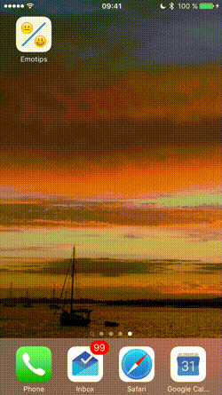
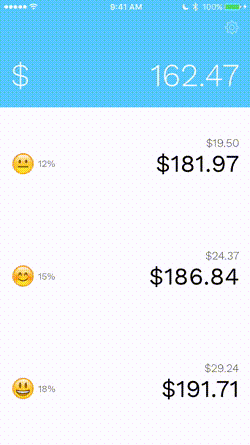

# Pre-work - Emotips

*Because tipping is an emotional thing.*

Emotips is a tip calculator application for iOS.

Submitted by: Chengyin Liu

Time spent: 10 hours spent in total

## User Stories

The following **required** functionality is complete:

* [X] User can enter a bill amount, choose a tip percentage, and see the tip and total values.
* [X] Settings page to change the default tip percentage.

The following **optional** features are implemented:
* [X] UI animations
* [X] Remembering the bill amount across app restarts (if <10mins)
* [X] Using locale-specific currency and currency thousands separators.
* [X] Making sure the keyboard is always visible and the bill amount is always the first responder. This way the user doesn't have to tap anywhere to use this app. Just launch the app and start typing.

The following **additional** features are implemented:

- [X] Intuitive, simple and fun design with emojis that convey emotions
- [X] Autolayout support so the app could be used in landscape mode and on iPads

## Video Walkthrough

Here's a walkthrough of implemented user stories:

## Additional GIFS

### Locale Support

### Landscape Support

### Settings

### Saved session

## License

    Copyright 2016 Chengyin Liu

    Licensed under the Apache License, Version 2.0 (the "License");
    you may not use this file except in compliance with the License.
    You may obtain a copy of the License at

        http://www.apache.org/licenses/LICENSE-2.0

    Unless required by applicable law or agreed to in writing, software
    distributed under the License is distributed on an "AS IS" BASIS,
    WITHOUT WARRANTIES OR CONDITIONS OF ANY KIND, either express or implied.
    See the License for the specific language governing permissions and
    limitations under the License.
